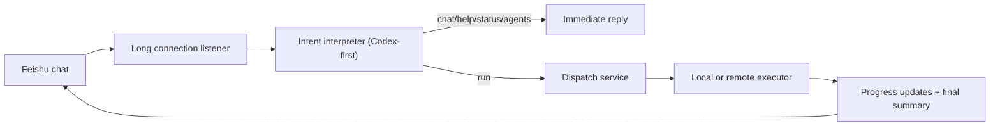

# codeClaw

`codeClaw` is a Feishu long-connection bridge for Codex. It lets you talk to Codex in Feishu like a normal chat, then routes each message to the right behavior:

- reply naturally for normal conversation
- answer usage questions
- show online machines
- look up job status
- dispatch real Codex work to a local or remote machine

It also borrows a few interaction details that make OpenClaw feel good in chat:

- add a `THINKING` reaction to the original message while work is in progress
- prefer natural-language interaction over slash-command syntax
- show process-style updates instead of only “job created / job done”

## What It Does

- Receives Feishu messages through long connection
- Uses Codex to interpret intent before deciding what action to take
- Keeps rule-based fallbacks so the bridge still works when intent routing is imperfect
- Supports direct chat replies for greetings, help, capability questions, and other non-execution prompts
- Dispatches executable tasks to the local machine or a selected remote machine
- Tracks machine presence through heartbeats
- Supports optional Redis persistence for jobs and agent presence
- Supports ACL restrictions for users, machines, and repositories
- Returns text and card updates back to Feishu

## High-Level Flow



## Repository Layout

```text
codeClaw/
├── src/
│   ├── services/
│   ├── queue/
│   └── store/
├── examples/
├── skill/
│   └── codeclaw/
├── .env.example
├── package.json
└── README.md
```

## Requirements

- Node.js 20+
- A Feishu self-built app with bot capability enabled
- `Codex CLI` available in `PATH` if you want real execution
- Optional: Redis for persistent state

## Feishu App Setup

Create or reuse a Feishu self-built app and make sure:

1. Bot capability is enabled
2. Event subscription mode is set to `long connection`
3. Event `im.message.receive_v1` is enabled
4. The app has the message send permissions you need
5. The app has message reaction capability if you want the in-message thinking reaction

This project was designed around long connection, so you do not need to expose a public webhook just to receive messages.

## Quick Start

1. Clone the repository.
2. Install dependencies.
3. Copy `.env.example` to `.env`.
4. Fill in your Feishu and local execution settings.
5. Start the service.

```powershell
npm install
Copy-Item .env.example .env
npm start
```

If startup succeeds, you should be able to open:

```text
http://127.0.0.1:8787/healthz
```

## Minimal `.env`

```text
PORT=8787
BASE_URL=http://127.0.0.1:8787

BRIDGE_SHARED_TOKEN=replace-me
INTERNAL_SHARED_TOKEN=replace-me-too

BRIDGE_ROLE=hybrid
AGENT_ID=office-pc
AGENT_LABEL=Office PC
COORDINATOR_URL=

FEISHU_APP_ID=cli_xxx
FEISHU_APP_SECRET=xxxx
FEISHU_VERIFICATION_TOKEN=
FEISHU_ENCRYPT_KEY=
FEISHU_LONG_CONNECTION_ENABLED=true

DEFAULT_REPO_PATH=C:/work
ALLOWED_REPO_ROOTS=C:/work

EXECUTOR_TYPE=codex-cli
CODEX_COMMAND=codex exec --json --skip-git-repo-check --dangerously-bypass-approvals-and-sandbox
```

## Chat Experience

You can talk to the bot naturally. The message does not need to start with `/codex`.

Examples:

```text
你好
你是谁，怎么用？
节点
状态 office-pc:1234
帮我检查最近的改动并给出修复建议
agent=office-pc repo=my-repo 帮我看看这个项目
```

Behavior:

- casual talk becomes a direct reply
- help/capability questions become a direct reply
- machine and status queries are routed to the relevant system actions
- execution requests become real Codex jobs

## Process Feedback

For execution-style messages, `codeClaw` does more than send a final result:

- adds a `THINKING` reaction to the original Feishu message
- sends an initial human-style acknowledgement
- emits lightweight progress updates while work is happening
- sends a final summary when the task completes
- removes the reaction when the handling path ends

This is intentionally closer to "chatting with a working agent" than "submitting a background ticket".

## Execution Modes

### `EXECUTOR_TYPE=mock`

Use this first to validate Feishu delivery and chat behavior.

### `EXECUTOR_TYPE=codex-cli`

Runs real Codex work through `codex exec`.

### `EXECUTOR_TYPE=shell`

Runs a custom command and passes job context through environment variables.

## Multi-Machine Mode

You can run `codeClaw` on several machines and dispatch work to a selected one.

Coordinator node:

- receives Feishu messages
- keeps the agent list
- forwards work when another machine is targeted

Worker node:

- runs the same service
- registers with the coordinator through heartbeat
- executes jobs locally

Example:

```text
agent=macbook-pro repo=my-repo 帮我检查最近的改动
```

## Redis Persistence

If `REDIS_URL` is set, the bridge stores job state and agent presence in Redis.

```text
REDIS_URL=redis://127.0.0.1:6379
REDIS_KEY_PREFIX=codeclaw
```

Without Redis, the bridge falls back to in-memory storage.

## Access Control

You can restrict who may use the bridge and what they may access.

Supported knobs:

- `ACL_ALLOWED_USERS`
- `ACL_ADMIN_USERS`
- `ACL_ALLOWED_AGENT_IDS`
- `ACL_ALLOWED_REPOS`
- `ACL_USER_RULES_JSON`

Example:

```text
ACL_ALLOWED_USERS=ou_xxx,ou_yyy
ACL_ALLOWED_AGENT_IDS=office-pc,macbook-pro
ACL_ALLOWED_REPOS=my-repo,infra-repo
ACL_USER_RULES_JSON={"ou_admin":{"agents":["*"],"repos":["*"]}}
```

## macOS Notes

`codeClaw` supports macOS nodes as execution machines.

Recommended settings:

```text
AGENT_ID=macbook-pro
AGENT_LABEL=Jack MacBook Pro
BASE_URL=http://192.168.1.23:8787
COORDINATOR_URL=http://192.168.1.10:8787
DEFAULT_REPO_PATH=/Users/jack/dev
ALLOWED_REPO_ROOTS=/Users/jack/dev,/Users/jack/work
```

## Local Skill

This repository includes a Codex skill at `skill/codeclaw`.

You can also install the same skill into your local Codex skills directory so another Codex instance can help deploy or operate `codeClaw`.

## Security Notes

- Do not commit `.env`
- Do not commit Redis credentials or Feishu secrets
- Restrict `ALLOWED_REPO_ROOTS`
- Prefer ACLs before opening the bot to more users
- Review `CODEX_COMMAND` carefully before sharing a deployment

## Development

Useful commands:

```powershell
npm start
node --check src/index.js
```

When testing long connection behavior, keep an eye on:

- `ws client ready`
- inbound message logs
- reaction add/remove logs
- progress updates and final summaries

## Publishing

This repository is intentionally sanitized:

- no `.env`
- no local logs
- no `node_modules`
- no machine-specific secrets

If you publish it as-is, other users only need to supply their own Feishu app credentials and local execution settings.
